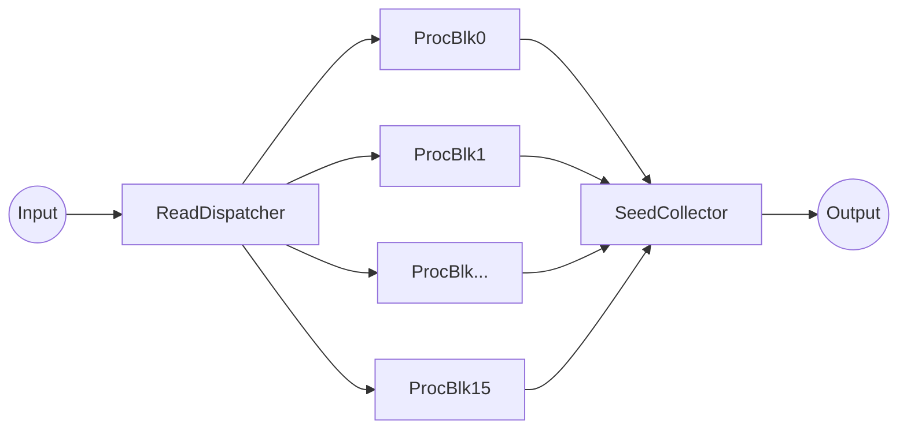
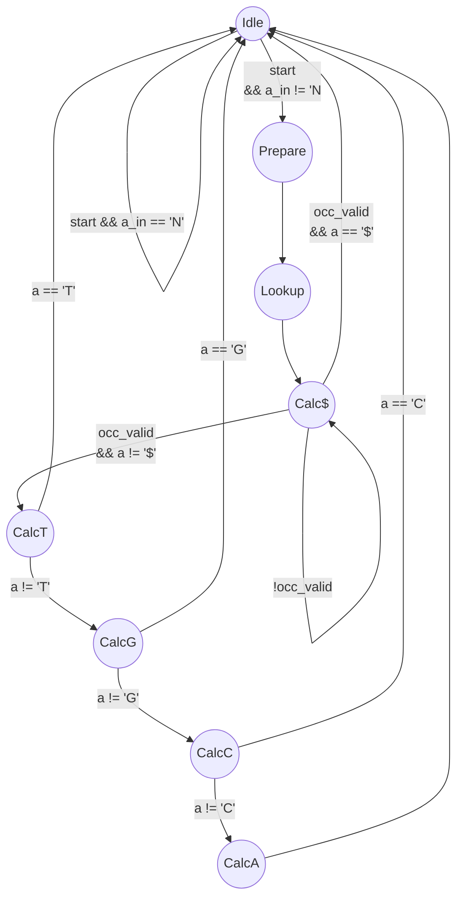
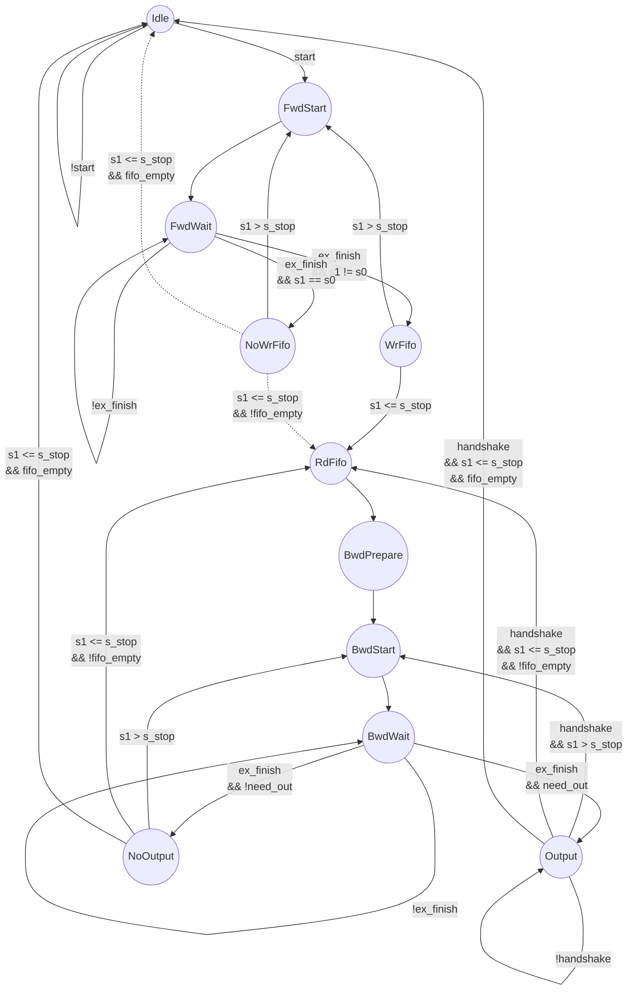
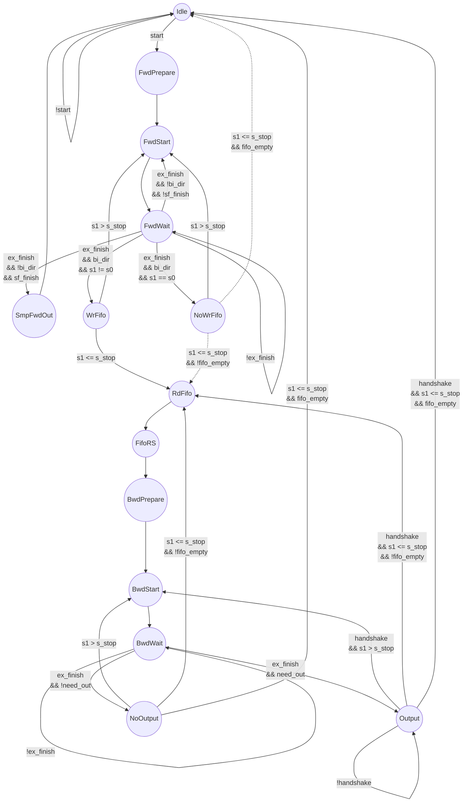
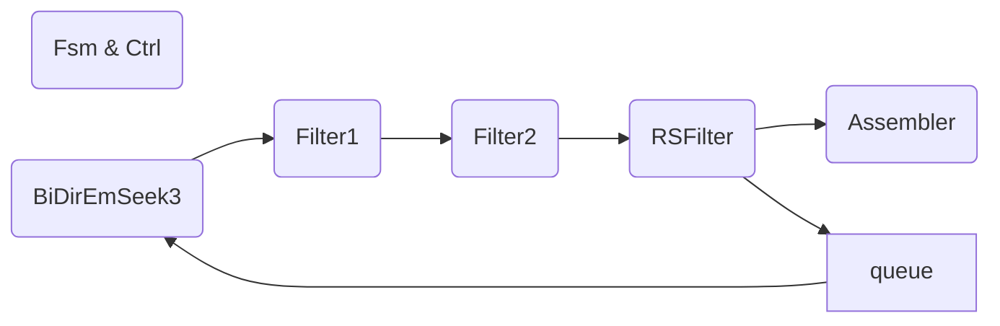
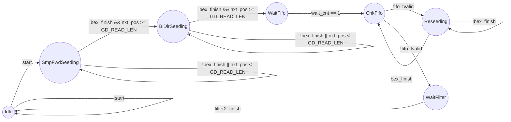
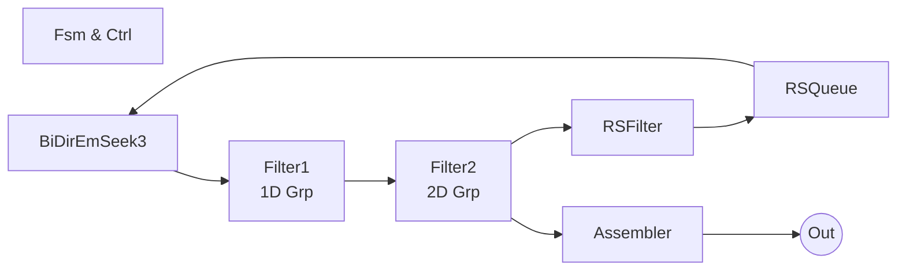
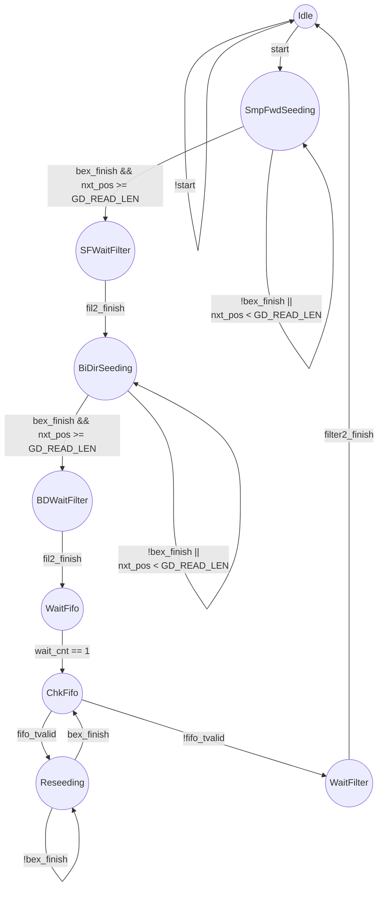
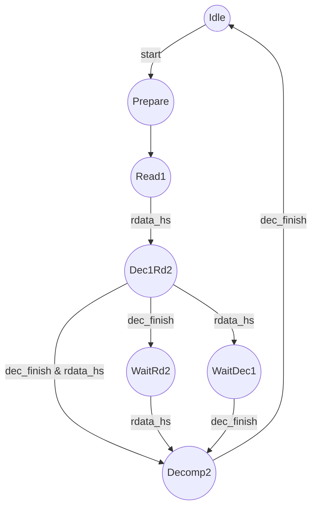

(see Project FPGA Impl. of BWA-MEM.md or pdf in doc/)

# Implementation of BWA-MEM in FPGA

## 1. System Structure

### 1.1 Read2Seed block

This is a brief introduction of one "Read To Seed" process block, for multi-channel and related memory and cache system, just open the IPI in vivado project.

A "read2seed" block is a complete process block input read and output several seeds.

 ```mermaid
graph TD
ex[Extension]
occDec[OccDecomp]
fil[GrpFilter<br>fil1 & fil2]
rsfil[RSFilter<br>& RSQueue]
memasm[SeedAsm]
workqu[MemQu]
subgraph ReadMemReseed
    subgraph BiDirEx
        ex
        subgraph OccLookUp
            occDec
        end
    	workqu    
    end
    fil
    rsfil
    memasm
end

	
 ```

Modules:

* Extension: input k0, l0, s0 and bp, output k1, l1 and s1.
* OccLookup & OccDecomp: lookup compressed occ table from memory system and decompress it.
* MemQu: working queue, temporarily store EMs with different intervals produced by forward extension, those EMs will be used by backward extension.
* BiDirEx: do forward ex and backword ex at a specified position of a read, output almost all EMs longer than the specified "min_mlen"(normally 18).
* GrpFilter: filter out shorter EMs included in another EM with same interval, those "shorter included" MEMs are considered as uninformative.
* RSFilter: pick out EMs should be reseeded.
* SeedAsm: assemble infomations and packed them for uploading to host.
* ReadMemRessed: implements "Simple Forward", "Bidir Seeding" and "Reseeding".

### 1.2 Process Block x16

16 process blocks combined by read dispatcher and seed collector.



Modules:

* ReadDispatcher: dispatch incoming read to the least IDed idle process block.
* SeedCollector: collect seeds from 16 process blocks, seeds with the same read ID will stay together in the output stream.

## 2. Definitions 

```verilog
package BwaMemDefines;

    typedef logic [2:0] Symbol;
    parameter Symbol sym_N      = 3'b000;
    parameter Symbol sym_$      = 3'b001;
    parameter Symbol sym_A 		= 3'b100;
    parameter Symbol sym_C 		= 3'b101;
    parameter Symbol sym_G 		= 3'b110;
    parameter Symbol sym_T 		= 3'b111;

    function automatic Symbol Compl(input Symbol s);
        Compl = {s[2], ~s[1:0]};
    endfunction

    // // 3-bit Symbol, used only in compressed Occ table and it's decompress
    // typedef logic [2:0] Sym3b;
    // parameter Sym3b sym3b_$       = 3'b000;
    // parameter Sym3b sym3b_A       = 3'b100;
    // parameter Sym3b sym3b_C       = 3'b101;
    // parameter Sym3b sym3b_G       = 3'b110;
    // parameter Sym3b sym3b_T       = 3'b111;
    // parameter Sym3b sym3b_N       = 3'b001;

    // function automatic Symbol Sym3to4(input Sym3b in);
    //     Sym3to4 = {1'b0, in};
    // endfunction

    // function automatic Sym3b Sym4to3(input Symbol in);
    //     Sym4to3 = in[2:0];
    // endfunction

    // extension direction
	parameter logic DirForward	= 1'b0;
	parameter logic DirBackward	= 1'b1;

    // working DW of k, l and s, 2^KLS_W = Max BWT Length
    // don't change this unless you are preparing to review all source code.
    parameter integer KLS_W = 40;

    // 2 * POS_W = n * 8, n = 1, 2, ...
    // POS_W >= Ceiling(Log2(READ_LEN + 3))
    parameter integer POS_W = 16;

    // width of read id
    parameter integer RID_W = 32;

    // 2^BIDIREX_QU_AW - 1 = Capacity of working queue in BiDirEmSeek
    // 2^RESEED_QU_AW = Capacity of reseed queue in ReadMemReseed
    // these 2 params:
    //  * too small may cause queue overflow (it's fatal error!)
    //  * too large ..., make sure you have enough block memory
    //  * Carefully choose their values
    parameter integer BIDIREX_QU_AW = 8; // at least $clog2(read_length), but may not be necessary
    parameter integer RESEED_QU_AW = 6;  // could be smaller than BEX_QU_AW

    // 2^SEEDOUT_QU_AW = Capacity of output queue of each processing block
    // too small will enlarge the probability of backpressure.
    parameter integer SEEDOUT_QU_AW = 8;

    // used in filters which filter mems to seeds
    // can be OVERRIDED in Read2Seeds instantiation.
    // when set to 2, seeds output will cover 95% of effective seeds in ref. result,
    // but generate average 12.4 seeds for each read (more redundant seeds).
    // when set to 1, seeds output will cover 80% of effective seeds in ref. result,
    // and generate average 6.1 seeds for each read (more efficient)
    parameter integer FILTER_GRP_SIZE = 2;

    // block of compressed Occ table
    typedef struct packed {
        logic [31:0][2:0] BwtSlice; //  32 * 3 = 96bit
        logic [39 : 0] OccT;        //  40 * 4 = 160bit
        logic [39 : 0] OccG;        // total: 256bit
        logic [39 : 0] OccC;
        logic [39 : 0] OccA;
    } OccBlock;

    typedef struct packed {
        logic [POS_W - 1 : 0]   j;  // tail position in guarded read
        logic [POS_W - 1 : 0]   i;  // head position in guarded read
        logic [KLS_W - 1 : 0]   s;  // interval
        logic [KLS_W - 1 : 0]   l;  // lower boundary of the reversed complementary
        logic [KLS_W - 1 : 0]   k;  // lower boundary of the original
    } WorkingMem;

    typedef struct packed {
        logic [POS_W - 1 : 0]   j;  // tail position in guarded read
        logic [POS_W - 1 : 0]   i;  // head position in guarded read
        logic [KLS_W - 1 : 0]   s;  // interval
    } ReseedMem;

    // size of AssemMem must be integer number of bytes
    typedef struct packed {
        logic [POS_W - 1 : 0]  j;  // tail position + 1 in read
        logic [POS_W - 1 : 0]  i;  // head position in read
        logic [KLS_W - 1 : 0]  s;  // interval will be saturate to [0,255]
        logic [KLS_W - 1 : 0]  l;  // lower boundary of the reversed complementary
        logic [KLS_W - 1 : 0]  k;  // lower boundary of the original
        logic [RID_W - 1 : 0]  id;
    } AssemMem;

    // parameter ASMMEM_W = $bits(AssemMem);
    // $bits is not supported by vivado ip packager -_-#
    parameter ASMMEM_W = 2*POS_W + 3*KLS_W + RID_W;
endpackage
```

## 3. Modules

### 3.1. Extension (Bi-dir)

#### Params and ports list

| io     | type/width    | name               | description                                                  |
| ------ | ------------- | ------------------ | ------------------------------------------------------------ |
| input  | wire          | clk                | clock                                                        |
| input  | wire          | rst                | synchronous reset, active high                               |
| input  | Symbol        | `a_in`             | new symbol input                                             |
| input  | wire          | `dir_in`           | 0 - forward, 1- backward                                     |
| input  | wire [KLS_W]  | `k_in`             | lower boundary of original seq                               |
| input  | wire [KLS_W]  | `l_in`             | lower boundary of rev-compl seq                              |
| input  | wire [KLS_W]  | `s_in`             | interval of seq                                              |
| input  | wire          | `start`            | initiate an extension                                        |
| output | logic [KLS_W] | `k_out`            | new lower boundary of original seq                           |
| output | logic [KLS_W] | `l_out`            | new lower boundary of rev-compl seq                          |
| output | logic [KLS_W] | `s_out`            | new interval of seq                                          |
| output | logic         | `finish`           | indicate process finished                                    |
| output | logic         | `busy`             | indicate in processing                                       |
| input  | wire [KLS_W]  | `acc_cnt_in[4]`    | C table value, 0-A, 1-C, 2-G, 3-T                            |
| input  | wire [KLS_W]  | `pri_pos_in`       | the position of '$' in BWT                                   |
| input  | wire          | `bwt_params_valid` | update acc_cnt and pri_pos                                   |
| output | logic [KLS_W] | `occ_k`            | k for lookup Occ table                                       |
| output | logic [KLS_W] | `occ_ks`           | k+s for lookup Occ table                                     |
| output | logic         | `occ_lookup`       | initiate an lookup                                           |
| input  | wire [KLS_W]  | `occ_val_k[4]`     | lookup result of Occ[x, k]<br>x: 0-'A', 1-'C', 2-'G', 3-'T'  |
| input  | wire [KLS_W]  | `occ_val_ks[4]`    | lookup result of Occ[x, k+s]<br>x: 0-'A', 1-'C', 2-'G', 3-'T' |
| input  | wire          | `occ_val_valid`    | indicate lookup result of <br>'A', 'C', 'G' and 'T' valid    |

#### Calculation sequence

Calculate procedure (dependences among variables are concerned):

1. Calc. `sumks = k + s`
   Store (take care of forward and backward) `k`, `l`, `s`
2. Lookup `O(, k)`, `O(, k+s)`
3. Calc. `l['$']=l`
   Calc. `k['$'] = C('$') + Occ('$', k)`(`= k > pos$? 1 : 0`)
   Calc. `s['$'] = Occ('$', k+s) - Occ('$', k)`(`= (k+s > pos$ && k <= pos$)? 1 : 0`)
   ** **if(a == '$') finish!** **
4. wait all other `O(, k)` and `O(, k+s)` valid
   Calc. `l['T'] = l['$'] + s['$']`
   Calc. `k['T'] = C('T') + Occ('T', k)` 
   Calc. `s['T'] = Occ('T', k+s) - Occ('T', k)`
   ** **if(a == 'T') finish!** **
5. Calc. `l['G'] = l'T' + s'T'`
   Calc. `k['G'] = C('G') + Occ('G', k)` 
   Calc. `s['G'] = Occ('G', k+s) - Occ('G', k)`
   ** **if(a == 'G') finish!** **
6. Calc **'C'**
7. Calc **'A'**

#### State machine

##### State machine chart





##### State machine table

| state   | event                   | nxt_state | do(may be incomplete)                                        |
| ------- | ----------------------- | --------- | ------------------------------------------------------------ |
| Idle    | `!start`                | Idle      |                                                              |
| Idle    | `start && a_in == 'N'`  | Idle      | latch `k_out`,`l_out`,`s_out`,`finish`                       |
| Idle    | `start && a_in != 'N'`  | Prepare   | latch `a`,`k`,`l`,`s`,`sumks`                                |
| Prepare |                         | Lookup    | `occ_lookup = 1`                                             |
| Lookup  |                         | Calc$     | `l$ <= l`<br>`k$ <= k > pos$? 1 : 0`,<br>`s$ <= (k+s > pos$ && k <= pos$)? 1 : 0` |
| Calc$   | `!occ_valid`            | Calc$     |                                                              |
| Calc$   | `occ_valid && a == '$'` | Idle      | latch `k_out`,`l_out`,`s_out`,`finish`                       |
| Calc$   | `occ_valid && a != '$'` | CalcT     | `lT <= l$ + s$`<br>`kT <= acc_cnt[3] + occ_val_k[3]`,<br>`sT <= occ_val_ks[3] - occ_val_k[3]` |
| CalcT   | `a == 'T'`              | Idle      | latch `k_out`,`l_out`,`s_out`,`finish`                       |
| CalcT   | `a != 'T'`              | CalcG     | `lG <= lT + sT`<br>`kG <= acc_cnt[2] + occ_val_k[2]`,<br>`sG <= occ_val_ks[2] - occ_val_k[2]` |
| CalcG   | `a == 'G'`              | Idle      | latch `k_out`,`l_out`,`s_out`,`finish`                       |
| CalcG   | `a != 'G'`              | CalcC     | `lC <= lG + sG`<br>`kC <= acc_cnt[1] + occ_val_k[1]`,<br>`sC <= occ_val_ks[1] - occ_val_k[1]` |
| CalcC   | `a == 'C'`              | Idle      | latch `k_out`,`l_out`,`s_out`,`finish`                       |
| CalcC   | `a != 'C'`              | CalcA     | `lA <= lC + sC`<br>`kA <= acc_cnt[0] + occ_val_k[0]`,<br>`sA <= occ_val_ks[0] - occ_val_k[0]` |
| CalcA   | `a == 'A'`              | Idle      | latch `k_out`,`l_out`,`s_out`,`finish`                       |
|         |                         |           |                                                              |

#### Sim result


### 3.2. BiDirEmSeek2 (obs.)

Bi-directional exact match seek (**NOT** compatible with simple forward extension phase)

#### Params and ports list

| IO                  | Type/Width    | Name                   | Description                                    |
| ------------------- | ------------- | ---------------------- | ---------------------------------------------- |
| param               | integer       | `GD_REAK_LEN`          | len of the input "guarded read"                |
| input               | wire          | `clk`                  | clock                                          |
| input               | wire          | `rst`                  | synchronous reset, active high                 |
| input               | wire Symbol   | `gd_read[GD_READ_LEN]` | "guarded read"                                 |
| input               | wire [POS_W]  | `pos_in`               | position to start                              |
| input               | wire          | `bi_dir`               | 0 - for simple forward ex<br>1 - for bi-dir ex |
| input               | wire          | `start`                | initiate an operation                          |
| output              | logic [POS_W] | `pos_out`              | break bp position                              |
| output              | logic         | `finish`               |                                                |
| output              | logic         | `busy`                 |                                                |
| Axi4StreamIf.source |               | `m_axis_emout`         | output of seek result(EMs)                     |
| Axi4LiteIf.master   |               | `m_axi_occlu`          | mm master for occ lookup                       |
| input               | wire [KLS_W]  | `acc_in[4]`            | acc count table                                |
| input               | wire          | `acc_valid`            |                                                |
| input               | wire [KLS_W]  | `pri_pos_in`           | position of '$' in bwt                         |
| input               | wire          | `pri_pos_valid`        |                                                |
| input               | wire [POS_W]  | `min_mlen_in`          | minimum length of output EMs                   |
| input               | wire          | `min_mlen_valid`       |                                                |
| input               | wire [KLS_W]  | `bwt_len_in`           | length of BWT(including '$')                   |
| input               | wire          | `bwt_len_valid`        |                                                |
| input               | wire [KLS_W]  | `min_intv_in`          | interval to stop ex.                           |
| input               | wire          | `min_intv_valid`       |                                                |

#### State machine

##### fsm chart



##### State machine table

| state      | event                                      | nxt_state  | do (may be incomplete)                                       |
| ---------- | ------------------------------------------ | ---------- | ------------------------------------------------------------ |
| Idle       | `!start`                                   | Idle       |                                                              |
| Idle       | `start`                                    | FwdStart   | `read <= read_in`<br>`i1 <= pos` `j1 <= pos`<br>`kls0 <= {0,0,bl}`<br>`dir <= DirForward` |
| FwdStart   |                                            | FwdWait    | `ex_start = 1`                                               |
| FwdWait    | `!ex_finish`                               | FwdWait    |                                                              |
| FwdWait    | `ex_finish && s1 != s0`                    | WrFifo     |                                                              |
| FwdWait    | `ex_finish && s1 == s0`                    | nWrFifo    |                                                              |
| WrFifo     | `s1 != 0`                                  | FwdStart   | `fifo_wr = 1`<br>`j1 <= j1 + 1`<br>`{i0, j0} <= {i1, j1}`<br>`kls0 <= kls1` |
| WrFifo     | `s1 == 0`                                  | RdFifo     | latch `pos_out`                                              |
| NoWrFifo   | `s1 != 0`                                  | FwdStart   | `j1 <= j1 + 1`<br>`{i0, j0} <= {i1, j1}`<br>`kls0 <= kls1`   |
| NoWrFifo   | `s1 == 0 && !fifo_empty`                   | RdFifo     | latch `pos_out`                                              |
| NoWrFifo   | `s1 == 0 && fifo_empty`                    | Idle       | latch `finish`,`pos_out `                                    |
| RdFifo     |                                            | BwdPrepare | `fifo_rd = 1`                                                |
| BwdPrepare |                                            | BwdStart   | `i1 <= fifo_q[...] - 1`<br>`j1 <= fifo_q[...]`<br>`{i0, j0} <= {i1, j1}`<br>`kls0 <= fifo_q[...]`<br>`dir <= DirBackward` |
| BwdStart   |                                            | BwdWait    | `ex_start = 1`                                               |
| BwdWait    | `!ex_finish`                               | BwdWait    |                                                              |
| BwdWait    | `ex_finish && need_out`                    | Output     | `m_axis_data, valid <= ...`                                  |
| BwdWait    | `ex_finish && !need_out`                   | NoOutput   |                                                              |
| Output     | `!handshake`                               | Output     | `tvalid = 1`                                                 |
| Output     | `handshake && s1 != 0`                     | BwdStart   | `i1 <= i1 - 1`<br>`kls0 <= kls1`<br>`tvalid = 1`             |
| Output     | `handshake && s1 == 0`<br>`&& !fifo_empty` | RdFifo     | `tvalid = 1`                                                 |
| Output     | `handshake && s1 == 0`<br>`&& fifo_empty`  | Idle       | `tvalid = 1`                                                 |
| NoOutput   | `s1 != 0 `                                 | BwdStart   | `i1 <= i1 - 1`<br>`kls0 <= kls1`                             |
| NoOutput   | `s1 == 0 && !fifo_empty`                   | RdFifo     |                                                              |
| NoOutput   | `s1 == 0 && fifo_empty`                    | Idle       |                                                              |

#### Sim result


### 3.3. BiDirEmSeek3

Same as BiDirEmSeek, but with reseed and "simple forward phase" compatible

#### Params and ports list

| IO                  | Type/Width    | Name                   | Description                                           |
| ------------------- | ------------- | ---------------------- | ----------------------------------------------------- |
| param               | integer       | `GD_REAK_LEN`          | len of the input "guarded read"                       |
| input               | wire          | `clk`                  | clock                                                 |
| input               | wire          | `rst`                  | synchronous reset, active high                        |
| input               | wire Symbol   | `gd_read[GD_READ_LEN]` | "guarded read"<br>read prefixed and suffixed with 'N' |
| input               | wire [POS_W]  | `pos_in`               | position to start                                     |
| input               | wire          | `bi_dir_in`            | 0 - for simple forward ex<br>1 - for bi-dir ex        |
| input               | wire          | `start`                | initiate an operation                                 |
| output              | logic [POS_W] | `pos_out`              | break bp position                                     |
| output              | logic         | `finish`               |                                                       |
| output              | logic         | `busy`                 |                                                       |
| Axi4StreamIf.source |               | `m_axis_emout`         | output of seek result(EMs)                            |
| Axi4LiteIf.master   |               | `m_axi_occlu`          | mm master for occ lookup                              |
| input               | wire [KLS_W]  | `acc_cnt_in[4]`        | acc count table                                       |
| input               | wire [KLS_W]  | `pri_pos_in`           | position of '$' in bwt                                |
| input               | wire [KLS_W]  | `bwt_len_in`           | length of BWT(including '$')                          |
| input               | wire          | `bwt_params_valid`     | update acc_cnt, pri_pos & bwt_len                     |
| input               | wire [POS_W]  | `min_mlen_in`          | minimum length of output EMs                          |
| input               | wire          | `min_mlen_valid`       |                                                       |
| input               | wire [KLS_W]  | `min_intv_in`          | interval to stop ex.                                  |
| input               | wire          | `min_intv_valid`       |                                                       |
| input               | wire          | `sf_mlen`              | length of MEM in Simple Forward                       |
| input               | wire          | `sf_max_intv`          | max. interval of MEM in Simple Forward                |
| input               | wire          | `sf_params_valid`      |                                                       |

#### FSM chart




### 3.4. Mem Filter 1

Filter output effective EMs within a backward group (a group produced in backward extension and with a same end position in read)

Examples of backward group & fiter1 group (see next section):


### 3.5. Mem Filter 2

Filter output effective EMs from the last N by N array within a filter1 group (when filter1 output a EM has different start pos & end pos from it's N-th previous one, we call this EM starts a new filter1 group and the previous one ends the last filter1 group).

MemFilter2 also generate `tlast` for the last mem within mems with same read id.

### 3.6. Mem Assembler

Assemble infomations, see definition of "AssemMem".

### 3.7. ReadMemReseed2 (obs.)

Find Seeds of a read.



#### Params and ports list

| I/O   | Type/Width   | Name           | Descr. |
| ----- | ------------ | -------------- | ------ |
| input | wire [POS_W] | `min_rslen_in` |        |
|       |              |                |        |
|       |              |                |        |


#### State Machine




### 3.7. ReadMemReseed3

Find Seeds of a read.



#### Params and ports list

| I/O   | Type/Width   | Name           | Descr. |
| ----- | ------------ | -------------- | ------ |
| input | wire [POS_W] | `min_rslen_in` |        |
|       |              |                |        |
|       |              |                |        |


#### State Machine




### 3.8. OccLookup

Lookup Compressed Occ Block, and use decompress module to convet it to Occ values of A, C, G, T.

#### State Machine



### 3.9. OccDecompress


## Extra Ultilities

### bwt2cocc

Command line tool wrote in C++, convert bwt file to compressed occ table file used by FPGA.

#### BWT File

bwt file format (described in c struct, little-endian)

```c
// Total length in bytes: 40 + ceil(BwtLenght / 16.0) * 4
struct BwtFile
{
    u64 PrimaryPosition;	// position of '$' in bwt
    u64 AccuCount_C;		// c table element of 'C' (without counting '$')
    u64 AccuCount_G;		// c table element of 'G' (without counting '$')
    u64 AccuCount_T;		// c table element of 'T' (without counting '$')
    u64 BwtLength;			// bwt length (without '$')
    // Slice of 16 symbols: 2 bits each symbol, 0b00-A, 0b01-C, 0b10-G, 0b11-T
    // First symbol in lower bits
	u32 SliceOf16Symbol[ceil(BwtLenght / 16.0)];
}
```

#### Occ Table (and Compress)

The (uncompressed) Occ table is constructed from BWT string **with** **'$'**, and has (BwtLenght + 1) element using the definition:
$$
occ(a, i) = \vline \{ 0 \le j \lt i \vline BWT[j]=a \} \vline
$$
Becaulful of the "less than" sign, it's different from definitions in some papers.

Compressed file is an array of blocks witch contains 4 40-bit AccuCount values ('A', 'C', 'G' and 'T') and 32 3-bit symbols in BWT. 

Compressed block format (described in SystemVerilog struct, little-endian):

```verilog
// Total lenght 256 bits, 32 bytes
// be aware of that verilog struct place the first element in MSB
typedef struct packed {
    logic [31:0][2:0] BwtSlice; //  32 * 3 = 96bit
    logic [39 : 0] OccT;        //  40 * 4 = 160bit
    logic [39 : 0] OccG;        // total: 256bit
    logic [39 : 0] OccC;
    logic [39 : 0] OccA;
} OccBlock;
```

The whole compressed file will have $\lfloor BwtLength / 32 \rfloor + 1$ blocks. The last one have at least one dummy symbols at the end if the $BwtLength$ is not a multiple of 32. If $BwtLength$ is a multiple of 32, the last block will be full of dummy symbols, this is intended to maintain consistency of decompress procedure. Compressed file size in bytes:
$$
32 \times ( \lfloor BwtLength / 32 \rfloor + 1)
$$
Regardless of the 4 `AccuCount_?`s, symols in all blocks make up the complete BWT string with '$'.

`AccuCount_?`s are occurrences of symbol `?` in all symbols before the block which it resides in.

##### Decompress procedure

For looking up $Occ(a, i)$:

1. Get `block = CompressedOccBlock[i / 32]` at byte address `i & 40'hF_FFFF_FFFE0` (40-bit address)

2. `c = block.AccuCount_<a>`, `s = block.Symbols`

3. $Occ(a,i) = c + \vline \{ 0 \le j \lt \textrm{rem}(i, 32)\vline s[j]=a \} \vline $ (c plus the count of 'a' before(exc.) rem(i, 32)).


